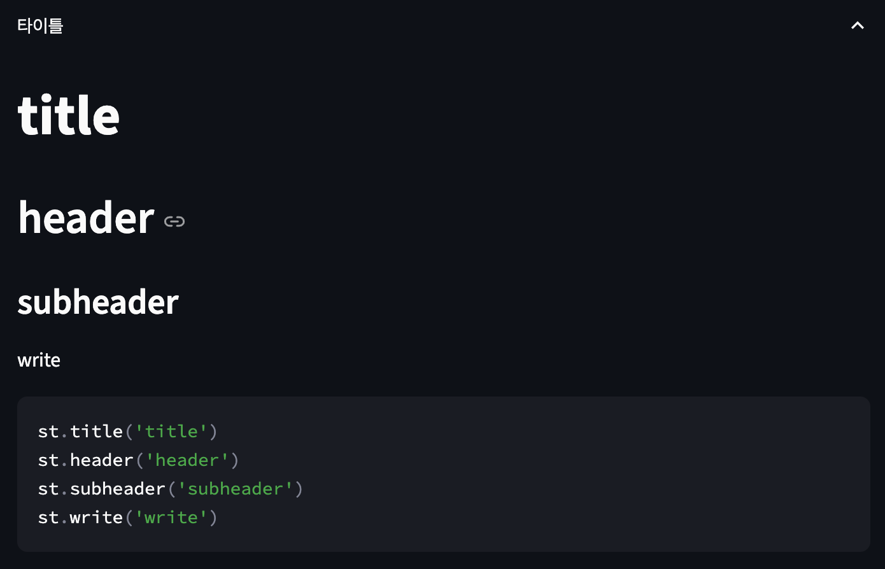
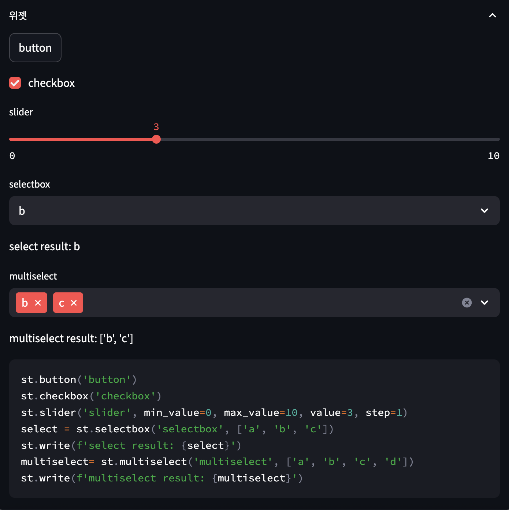
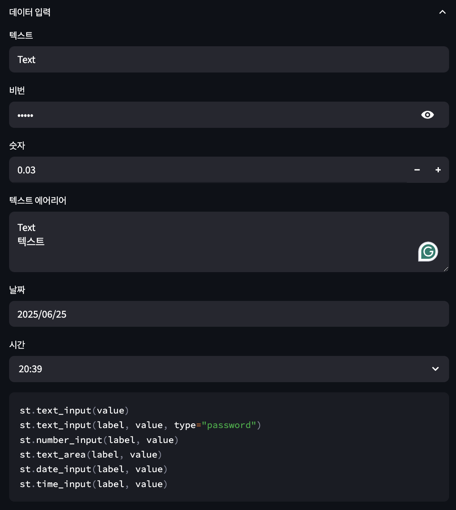
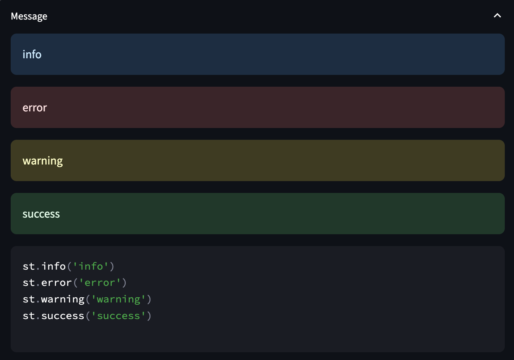

# Streamlit Tutorials

>Streamlit은 머신러닝과 데이터사이언스를 위한 웹 앱을 구축하기 위한 오픈소스 파이썬 프레임워크로, 빠르게 웹 앱을 개발하고 쉽게 배포할 수 있습니다. Streamlit을 통해 파이썬 코드를 작성하는 것과 동일한 방식으로 앱을 작성할 수 있어 코딩과 웹 앱에서의 결과를 확인하는 대화형 루프 작업을 원활하게 만들어 줍니다.
>본 예제를 통해 Streamlit의 UI 컴포넌트 별 사용 방법 및 예제를 확인할 수 있습니다.

#### 설치
```
pip install streamlit
```

#### 실행
```
cd [dir]
streamlit run app.py --server.address 0.0.0.0 --server.port [your port]
#server.address 및 port를 지정하지 않는 경우, localhost:8501로 실행
```
####

<p align="center">
    
</p>

####

<p align="center">
    
</p>

####

<p align="center">
    
</p>

####

<p align="center">
    
</p>

##Streamlit API 참조
**📒 Useful resource**
- [`streamlit.io`](https://docs.streamlit.io/)
- [`awesome-streamlit`](https://github.com/MarcSkovMadsen/awesome-streamlit)
- [`streamlit gallery`](https://streamlit.io/gallery)
''')